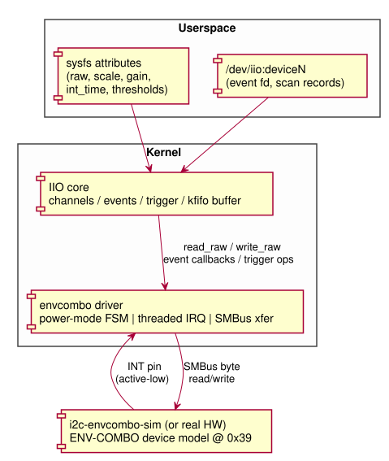
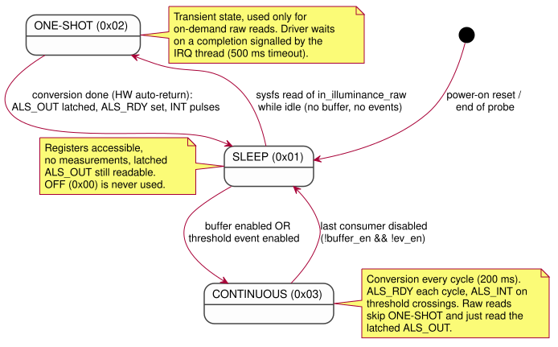
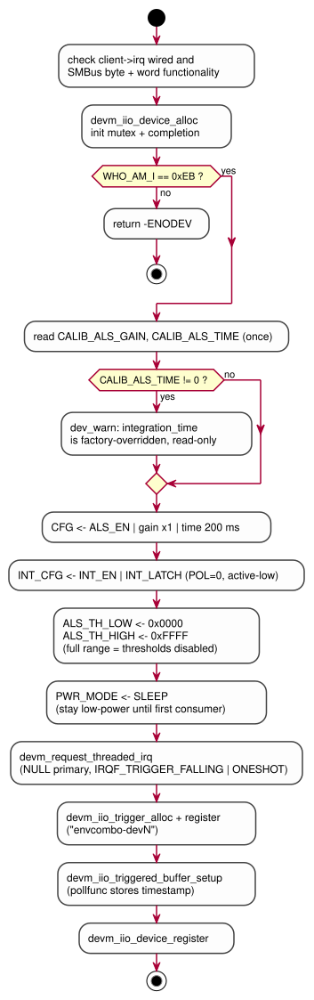
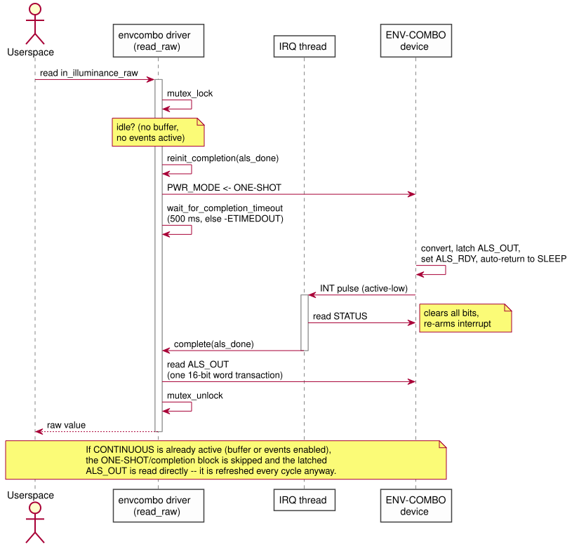
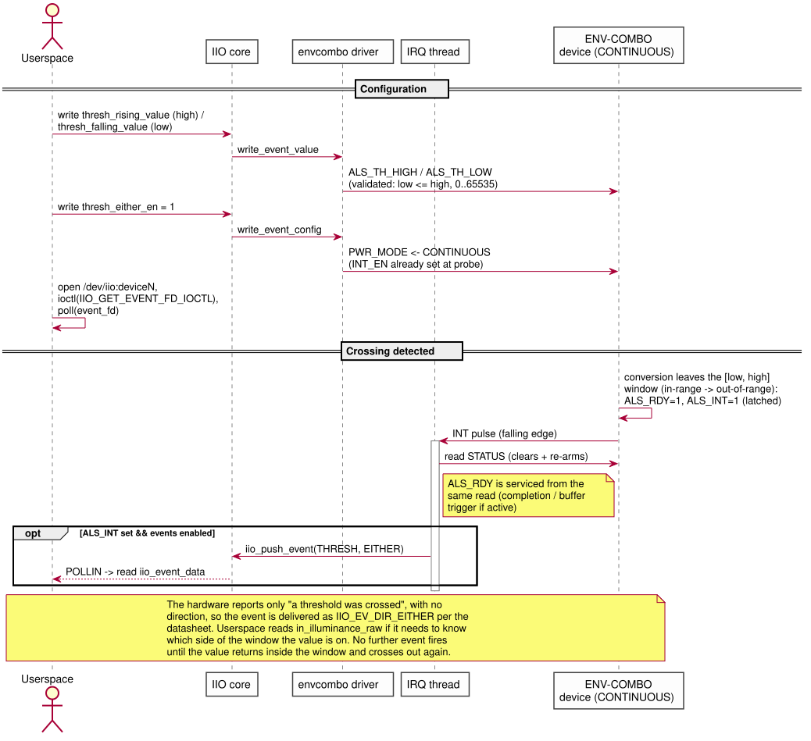
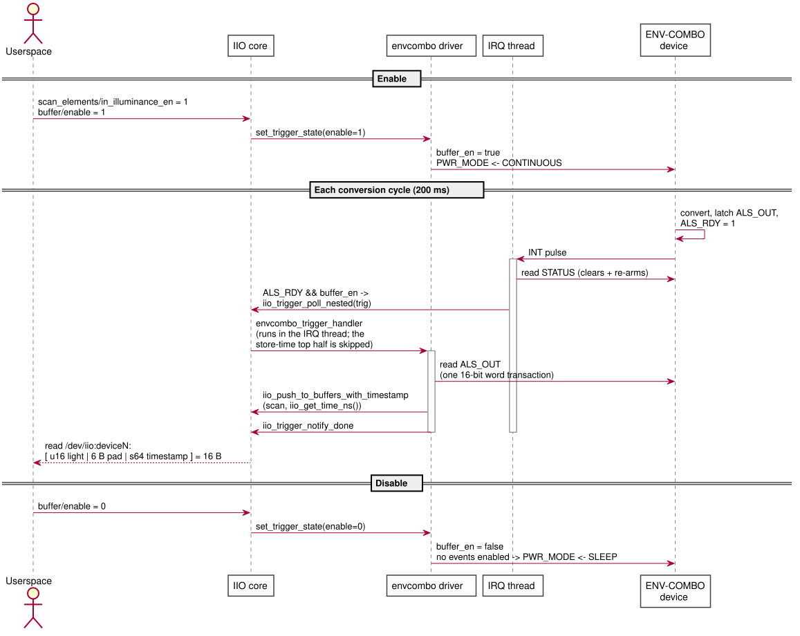

= ENV-COMBO IIO Driver -- Architecture & Design
:toc:
:toclevels: 2
:sectnums:
:docinfo: shared

[.back-to-index]
link:index.html[<- Back to documentation index]

This document describes the architecture of the `envcombo` Linux IIO driver
(`recipes-kernel/envcombo-driver/files/envcombo.c`) for the fictional
ENV-COMBO I2C combo sensor. Only the ambient-light (ALS, `IIO_LIGHT`) path is
implemented; temperature and humidity are out of scope for this assignment.

NOTE: Diagrams are maintained as PlantUML sources in `+docs/diagrams/*.puml+`
and embedded as SVGs rendered into `docs/diagrams/svg/`. Regenerate after
editing with `+plantuml -tsvg -o svg docs/diagrams/*.puml+`.

== System Overview

The driver sits between the IIO core and an I2C device at address `0x39`.
In this project the device is provided by a simulator module
(`i2c-envcombo-sim`) that registers both the I2C adapter and the client
device, and delivers interrupts through a software IRQ domain. The driver is
completely unaware of the simulator -- it would bind unchanged to real
hardware exposing the same register map.

== Hardware Model (ALS-relevant subset)

=== Register map

[cols="1,2,4", options="header"]
|===
| Addr | Register | Use by this driver

| 0x00 | WHO_AM_I | Identity check at probe; must read `0xEB`, else `-ENODEV`
| 0x04-0x05 | ALS_OUT (MSB/LSB) | Latched 16-bit big-endian ALS result
| 0x06 | CFG | `ALS_EN` (bit 7), `ALS_GAIN` (bits 4:3), `ALS_TIME` (bits 2:1)
| 0x07 | INT_CFG | `INT_EN` (bit 7), `INT_LATCH` (bit 6), `INT_POL` (bit 5)
| 0x08-0x09 | ALS_TH_LOW (MSB/LSB) | Falling threshold (alert when value goes below)
| 0x0A-0x0B | ALS_TH_HIGH (MSB/LSB) | Rising threshold (alert when value goes above)
| 0x0C | STATUS | `ALS_RDY` (bit 3), `ALS_INT` (bit 0); *all bits clear on read*
| 0x10 | CALIB_ALS_GAIN | Factory gain trim, multiplies effective gain
| 0x11 | CALIB_ALS_TIME | Factory integration-time override (ms); non-zero = override
| 0x12 | PWR_MODE | OFF `0x00` / SLEEP `0x01` / ONE-SHOT `0x02` / CONTINUOUS `0x03`
|===

All 16-bit fields are big-endian register pairs: MSB at the base address,
LSB at base + 1. The driver accesses each pair as a *single* SMBus word
transaction (`i2c_smbus_read_word_swapped()` /
`i2c_smbus_write_word_swapped()` behind `envcombo_read_reg16()` /
`envcombo_write_reg16()`), so a concurrent device-side update -- e.g. a new
ALS sample latched in CONTINUOUS mode -- can never tear the value between
the two bytes.

=== Device behavior (per datasheet)

Power modes::
The device powers up in SLEEP: registers are accessible but no measurements
run. Writing ONE-SHOT triggers a single conversion; on completion the result
is latched into ALS_OUT, `ALS_RDY` is set, and the device *returns to SLEEP
automatically*. CONTINUOUS runs periodic conversions (200 ms cycle in the
simulator). OFF halts all activity; the driver never uses it, since SLEEP
already takes no measurements while keeping latched values readable.

STATUS semantics::
All STATUS bits are cleared by a read, which also re-arms the interrupt.
`ALS_RDY` means a new conversion result since the last STATUS read.
`ALS_INT` flags a threshold *crossing* -- a transition from in-range to
out-of-range. It does not re-fire while the value stays out of range; the
value must return in-range first. A crossing always coincides with new data
(`ALS_RDY`), but the two flags are distinct.

Interrupt pin::
The INT pin pulses whenever any STATUS bit transitions 0 -> 1, with polarity
selected by `INT_POL` (0 = active-low, the power-on default). `INT_LATCH=1`
keeps `ALS_INT` set until STATUS is read even if the value returns in-range;
with `INT_LATCH=0` the flag self-clears, which can lose events (see
<<design-decisions>>).

== Driver Architecture

=== Components and state

....
  struct envcombo_data
  +--------------------------------------------------------------+
  | client            i2c_client for SMBus byte access           |
  | lock              mutex: serializes config & one-shot reads  |
  | als_done          completion: IRQ thread -> raw-read waiter   |
  | trig              IIO trigger, fired from the IRQ thread     |
  | als_gain_idx/als_time_idx   shadow of CFG gain/time fields   |
  | calib_again/calib_atime     factory trim, read once at probe |
  | thresh_low/thresh_high      shadow of ALS_TH_LOW/HIGH        |
  | ev_en                       threshold event enabled (sysfs)  |
  | buffer_en                   trigger/buffer active            |
  | scan { u16 light; s64 timestamp } __aligned(8)               |
  +--------------------------------------------------------------+
....

Locking model:

* `data->lock` (mutex) protects all configuration paths (sysfs writes,
  power-mode changes) and the one-shot raw-read sequence.
* The threaded IRQ handler deliberately does *not* take the mutex: a raw
  read can hold it for up to 500 ms while waiting on the completion, and
  blocking the handler would delay re-arming the interrupt. Instead the
  handler snapshots `ev_en` / `buffer_en` with `READ_ONCE()`, paired with
  `WRITE_ONCE()` on the sysfs write side.
* All resources are `devm_`-managed; the driver has no `.remove()`.

=== Power-mode state machine

The driver keeps the device in the lowest power state that satisfies the
currently active consumers. Two boolean inputs drive the FSM: `buffer_en`
(triggered buffer running) and `ev_en` (threshold event enabled).
`envcombo_update_power_mode()` recomputes the target mode whenever either
changes; ONE-SHOT is a transient state used only for on-demand raw reads
while otherwise idle.

`PWR_MODE` is *driver-derived, not a userspace knob*: there is no sysfs
attribute to set it. Userspace only toggles the standard IIO features --
enabling/disabling the buffer (via `set_trigger_state`) and the threshold
event (via `write_event_config`) -- and the driver maps that combination to
SLEEP or CONTINUOUS (CONTINUOUS while either is active, SLEEP once the last
one is disabled). This keeps the power state always consistent with what is
actually in use, which a directly-writable mode could not guarantee.

While CONTINUOUS is active, a sysfs raw read skips the ONE-SHOT round-trip
and simply reads the latched ALS_OUT registers -- they are refreshed every
cycle anyway.

== ALS Usage Flows

=== Probe / initialization

=== On-demand raw read (one-shot path)

`cat /sys/bus/iio/devices/iio:deviceN/in_illuminance_raw` while no buffer or
event is active:

=== Threshold event flow

Userspace configures `in_illuminance_thresh_rising_value` (-> ALS_TH_HIGH)
and `in_illuminance_thresh_falling_value` (-> ALS_TH_LOW), then enables the
single `..._thresh_either_en` switch. Enabling it drives the FSM to
CONTINUOUS (`INT_CFG.INT_EN` is already set at probe, since the data-ready
interrupt is needed for one-shot reads too).

The hardware reports only "a threshold was crossed" via the single
direction-less `ALS_INT` bit, so the event spec follows the datasheet: the
two threshold *values* are exposed through the rising/falling `VALUE`
attributes, while the event itself is enabled and delivered with
`IIO_EV_DIR_EITHER`. Userspace that needs to know which side of the window
was crossed reads the current value (see <<design-decisions>>).

Threshold writes are validated: a rising value below the current falling
value (or vice versa), values outside 0..65535, and negative values are all
rejected with `-EINVAL`, so the window stays well-formed.

=== Triggered buffer flow

The driver registers its own IRQ-backed trigger; no external trigger is
needed. Enabling the buffer drives the FSM to CONTINUOUS, and every
conversion produces one scan record.

== Userspace ABI

[cols="3,2,4", options="header"]
|===
| sysfs attribute (`iio:deviceN/`) | Backing register | Semantics

| `name` | -- | `"envcombo"`
| `in_illuminance_raw` | ALS_OUT | On-demand read; one-shot conversion when idle, latched value when CONTINUOUS
| `in_illuminance_scale` | CFG gain + CALIB_ALS_GAIN | `1 / (gain x calib_gain)`, `IIO_VAL_FRACTIONAL`; illustrative 1.0 lux/count @ gain 1
| `in_illuminance_hardwaregain` (+`_available`) | CFG[4:3] | One of `1 4 16 64`; invalid writes -> `-EINVAL`
| `in_illuminance_integration_time` (+`_available`) | CFG[2:1] | One of `0.05 0.1 0.2 0.4` *seconds* (`IIO_VAL_INT_PLUS_MICRO`); when the CALIB_ALS_TIME override is set, writes return `-EOPNOTSUPP` and `_available` lists only the calibrated time
| `events/in_illuminance_thresh_rising_value` | ALS_TH_HIGH | Raw ALS counts (`0..65535`, same unit as `in_illuminance_raw`); must stay >= falling value
| `events/in_illuminance_thresh_falling_value` | ALS_TH_LOW | Raw ALS counts (`0..65535`); must stay \<= rising value
| `events/in_illuminance_thresh_either_en` | power FSM | Enables the (direction-less) crossing event and CONTINUOUS mode
| `buffer/`, `scan_elements/`, `trigger/` | -- | Standard IIO triggered-buffer interface; scan: u16 light @ index 0 + s64 timestamp
| `/dev/iio:deviceN` | -- | Buffered scan records + `IIO_GET_EVENT_FD_IOCTL` event stream
|===

[[design-decisions]]
== Design Decisions & Tradeoffs

Plain `i2c_smbus` instead of regmap::
The device has 19 byte-wide registers and the driver touches 11 of them; a
regmap adds little. Decisive practical point: `CONFIG_REGMAP_I2C` is a
hidden Kconfig symbol that in-tree drivers pull in via `select`, which an
out-of-tree module cannot do cleanly. Register caching would be wrong
anyway (STATUS is clear-on-read, ALS_OUT is hardware-latched).

Hybrid power strategy (SLEEP / ONE-SHOT / CONTINUOUS)::
Matches the power-on default (SLEEP) and keeps the device idle until
userspace actually uses it -- no conversions, interrupts, or I2C traffic run
while nothing is consuming ALS data -- correct resource use that also keeps
the device in its hardware reset state until something needs it. Tradeoff:
more state tracking (two consumer flags +
`envcombo_update_power_mode()`) than a naive "CONTINUOUS at probe" design,
and the first raw read pays one conversion of latency (bounded by the 500 ms
completion timeout).

`INT_LATCH=1`::
With latching off, `ALS_INT` self-clears once the value returns in-range.
If that happens between the INT pulse and the threaded handler's STATUS
read, the event would be silently lost. Latching guarantees the handler
observes every real crossing. Cost: none for this driver, since the single
STATUS read both acknowledges and re-arms.

Threaded IRQ, single STATUS read::
`devm_request_threaded_irq` with a NULL primary handler (so `IRQF_ONESHOT`
is mandatory) keeps all I2C traffic out of hard-IRQ context. One STATUS
read serves every consumer at once -- raw-read completion, buffer trigger,
and threshold events can all result from the same pulse, since a crossing
always coincides with new data. The INT pin pulses on each STATUS 0 -> 1
transition, so the IRQ is requested as `IRQF_TRIGGER_FALLING`, matching
`INT_POL=0` (active-low), the power-on default the driver keeps. Because
the trigger fires from thread context, the driver uses
`iio_trigger_poll_nested()` (the plain `iio_trigger_poll()` is reserved for
hard-IRQ context) and the buffer handler takes its own timestamp.

`IIO_EV_DIR_EITHER` events::
The hardware reports a crossing through a single direction-less `ALS_INT`
flag, so the driver follows the datasheet and pushes the event as
`IIO_EV_TYPE_THRESH` / `IIO_EV_DIR_EITHER` (the in-tree pattern used by
e.g. `apds9960`): rising/falling event specs carry only the two threshold
values, a third EITHER spec carries the single enable. Synthesizing a
direction in the driver by re-reading the sample would be guesswork during
fast swings; the EITHER contract is honest about what the silicon knows.

Mutex-free IRQ thread::
The raw-read path can hold `data->lock` for up to 500 ms (completion
timeout). Taking that mutex in the IRQ thread would stall interrupt
re-arming behind a slow reader, so the handler uses `READ_ONCE()` snapshots
of `ev_en` / `buffer_en` instead, paired with `WRITE_ONCE()` writers.

`devm_`-managed lifecycle::
Every resource (IIO device, trigger, buffer, IRQ) is device-managed and
torn down in reverse order automatically; the driver needs no `.remove()`.
The `iio_trigger_get()` reference taken for `indio_dev->trig` is dropped by
the IIO core itself in `iio_dev_release()` -- the driver must *not* add its
own put (doing so underflows the trigger refcount on unbind). The device is
left in SLEEP whenever no consumer is active, which is also the correct
state to leave behind on unbind.

== Source Layout

[cols="3,4", options="header"]
|===
| Path | Role

| `recipes-kernel/envcombo-driver/files/envcombo.c` | The IIO driver (this document)
| `recipes-kernel/envcombo-sim/files/i2c-envcombo-sim.c` | Provided bus + device simulator (reference only, not modified)
| `recipes-kernel/linux/linux-yocto/iio.cfg` | Kernel config fragment (IIO core, buffer, trigger, kfifo)
| `recipes-utils/envcombo-test/files/envcombo-test/src/main.rs` | Rust userspace test harness
| `DESIGN.md` | Condensed 1-2 page design rationale (assignment deliverable)
|===
