= ENV-COMBO IIO Driver -- Manual Debugging & Binary Inspection
:toc:
:toclevels: 2
:sectnums:
:docinfo: shared

[.back-to-index]
link:index.html[<- Back to documentation index]

Host-side inspection of the device's binary interfaces: decoding the
simulator's register file and captured ALS buffers with
https://imhex.werwolv.net/[ImHex] and the pattern files under
`docs/imhex/`. This is a debugging/analysis workflow -- for installing,
booting, and operating the driver see
link:user-guide.html[Installation, Build & Run]; for a quick on-target
register peek without leaving the guest, the `hexdump` of
`/sys/kernel/debug/envcombo-sim/regs` shown there is enough.

ImHex runs on the Windows host while QEMU runs under WSL2, so every capture
below follows the same pattern: a one-shot `nc` listener in WSL2 (where the
guest's slirp gateway `10.0.2.2` resolves) writes the blob to a
Windows-visible path, then the guest sends it.

== Inspecting register state with ImHex

The simulator exposes its full register file at
`/sys/kernel/debug/envcombo-sim/regs` (19 bytes, one byte per register,
16-bit fields big-endian). Capturing that blob and decoding it with the
`docs/imhex/envcombo-als.hexpat` pattern gives a field-by-field view of the
device state at a chosen moment.

This walkthrough captures *one* snapshot after putting the device into a
known state.

=== Step 1 -- Start a one-shot listener (WSL2)

Accept a single connection and write it where Windows ImHex can open it:

[source,sh]
----
nc -l 7777 > /mnt/c/Users/<windows-user>/regs.bin
----

=== Step 2 -- Set thresholds and power mode (guest)

Drive the device through its real sysfs ABI, so the change goes through
the I2C write path and lands in the actual registers:

[source,sh]
----
cd /sys/bus/iio/devices/iio:device0     # adjust N if not device0

# Thresholds -> ALS_TH_LOW (0x08-09) / ALS_TH_HIGH (0x0A-0B).
# Keep the window well-formed: low <= high at every step.
echo 100 > events/in_illuminance_thresh_falling_value
echo 800 > events/in_illuminance_thresh_rising_value

# Power mode is FSM-driven, not directly writable. Enabling a consumer
# drives PWR_MODE (0x12) to CONTINUOUS (0x03); disabling all consumers
# returns it to SLEEP (0x01).
echo 1 > events/in_illuminance_thresh_either_en
----

=== Step 3 -- Dump and send the register file once

[source,sh]
----
nc 10.0.2.2 7777 < /sys/kernel/debug/envcombo-sim/regs
----

The listener from Step 1 receives the 19 bytes and exits; `regs.bin` now
holds the snapshot.

=== Step 4 -- Decode in ImHex (Windows)

Open `C:\Users\<windows-user>\regs.bin`, load `docs/imhex/envcombo-als.hexpat`, and run
it. The Pattern Data view should now show, for this capture:

* `pwr_mode = Continuous`
* `als_th_low = 100`, `als_th_high = 800`
* `cfg.als_en = 1`, plus the live `als_out` reading

To capture a different state (e.g. the SLEEP baseline), disable the
consumer (`echo 0 > events/in_illuminance_thresh_either_en`) and repeat
from Step 1.

.ImHex decoding a register snapshot via `docs/imhex/envcombo-als.hexpat` -- here the SLEEP baseline (`pwr_mode = Sleep`, a 100/800 threshold window)
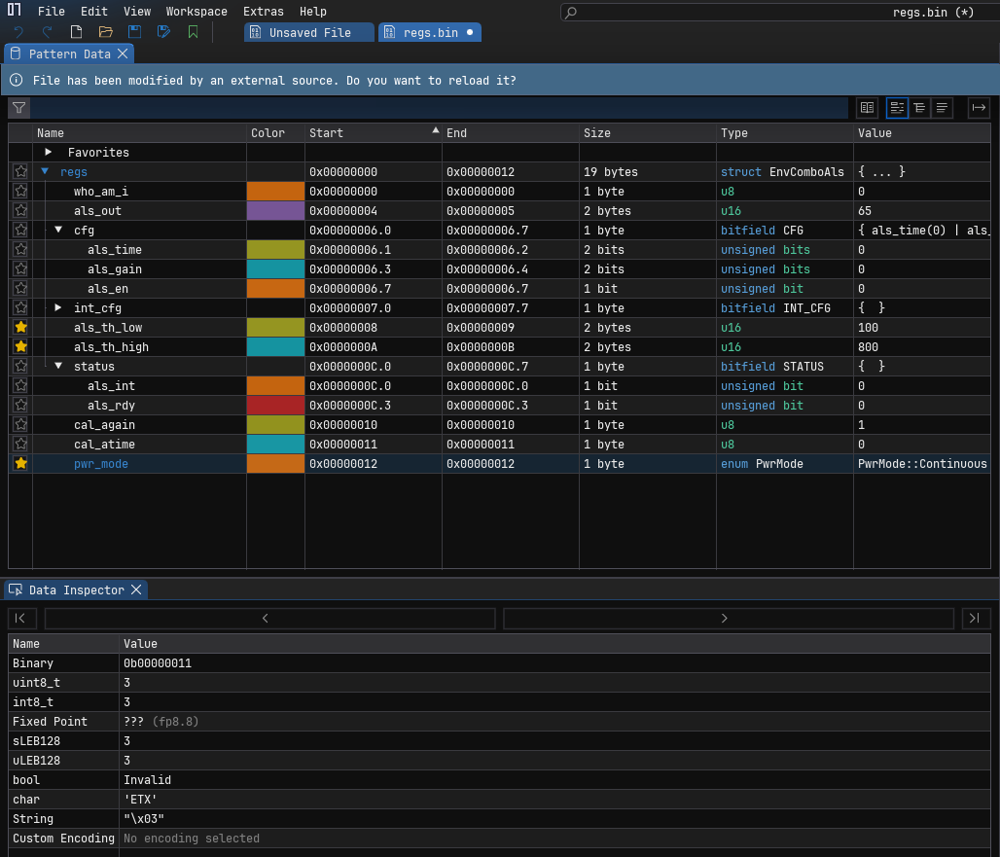

[NOTE]
====
The debugfs `regs` file is the source of truth for these captures: the
simulator reconstructs the threshold and ALS bytes from its internal
state on every read, so the dump always reflects the device as the driver
left it. Writing register bytes *into* debugfs is not equivalent to the
sysfs path above and is not used here.
====

[NOTE]
====
`docs/imhex/envcombo-als.hexpat` is declared `#pragma endian little` so the
bitfields fill LSB-first (first member = bit 0); the three 16-bit fields
(`als_out` and the two thresholds) are MSB-first and are tagged `be`
individually. This matters: under `#pragma endian big` ImHex 1.38.x fills
bitfields *MSB-first*, which silently mis-decodes CFG/INT_CFG/STATUS -- e.g.
a CFG of `0x84` reads back `als_en = 0` instead of 1, with the set bits
disappearing into the padding fields. If you see all-zero bitfield fields,
that flipped endian is why.

Each bitfield register is wrapped in a small `Reg8<T>` union so the Pattern
Data view shows the raw byte *and* the decoded fields together -- `cfg.raw`
reads `0x84` next to `cfg.bits.als_en = 1`.
====

.The `Reg8<CFG>` union in action -- `cfg.raw = 0x84` shown alongside the decoded bitfield (`als_en = 1`, `als_gain`, `als_time`)
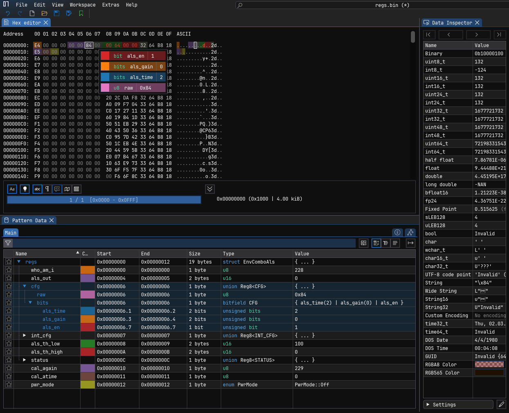

.The `be u16 als_out` field decoded MSB-first -- the latched 16-bit ALS reading from registers `0x04-0x05`
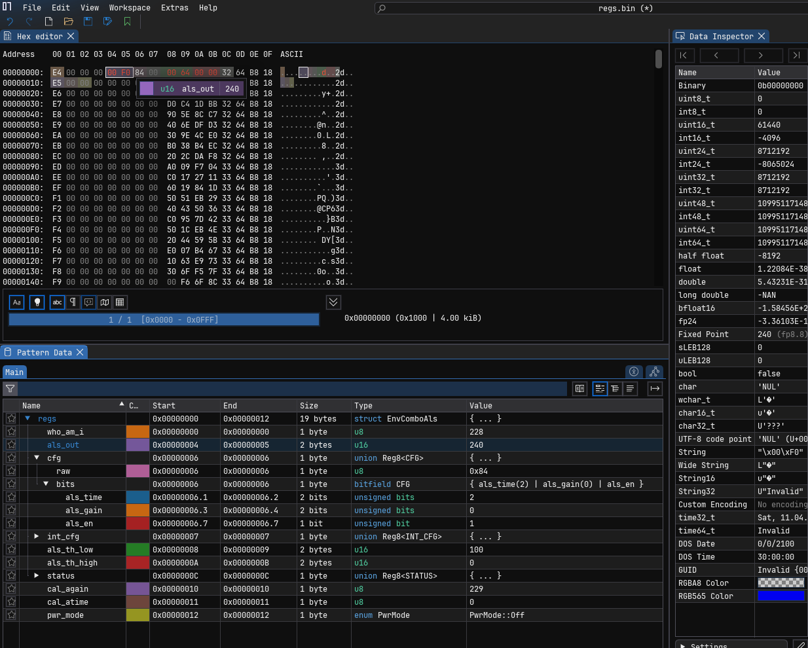

== Graphing ALS samples

For a light-vs-time plot rather than a register snapshot, capture the
triggered buffer with *only* the illuminance scan element enabled
(timestamp off), so every record is a bare little-endian `u16` and the
whole file is a clean stream of samples to plot:

[source,sh]
----
cd /sys/bus/iio/devices/iio:device0
echo 1 > scan_elements/in_illuminance_en
echo 0 > scan_elements/in_timestamp_en      # pure u16 records -- no padding/timestamp
echo envcombo-dev0 > trigger/current_trigger
echo 256 > buffer/length
echo 1 > buffer/enable
dd if=/dev/iio:device0 of=/tmp/als_lights.bin bs=2 count=256
echo 0 > buffer/enable
----

Send `als_lights.bin` to the host the same way as the register snapshot --
start Step 1's listener, then from the guest:

[source,sh]
----
nc 10.0.2.2 7777 < /tmp/als_lights.bin
----

Open it with `docs/imhex/envcombo-als-plot.hexpat`. Its
`+[[hex::visualize("line_plot", ...)]]+`
attribute draws light-vs-sample in ImHex's visualizer pane -- you'll see
the simulator's sawtooth ramp.

.ImHex `line_plot` of a captured ALS buffer -- the simulator's sawtooth ramp
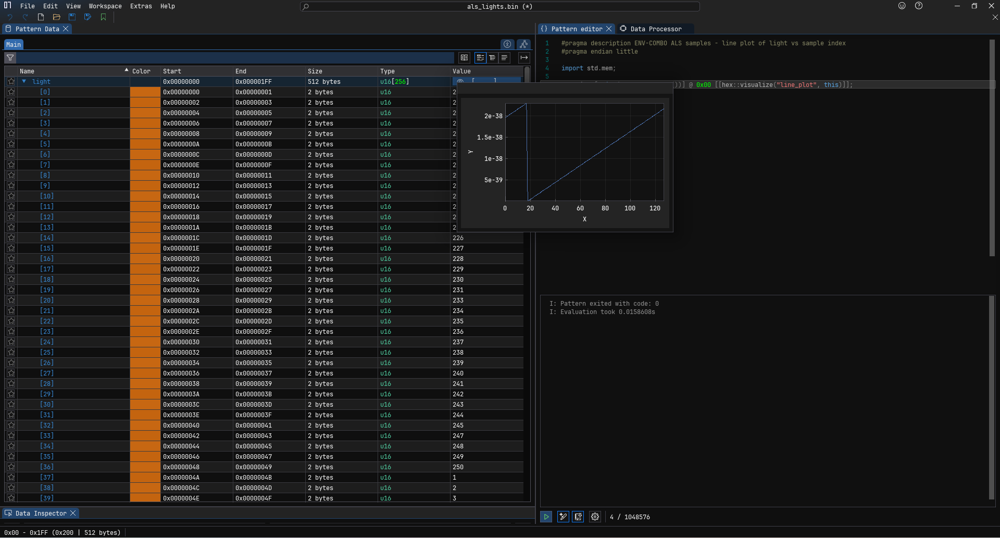

== Full records with timestamps

To inspect samples together with their timestamps instead of plotting,
keep the timestamp scan element enabled during the capture. Each record is
then 16 bytes -- a `u16` light value, 6 bytes of padding, then an `s64`
nanosecond timestamp.

Capture on the guest:

[source,sh]
----
cd /sys/bus/iio/devices/iio:device0
echo 1 > scan_elements/in_illuminance_en
echo 1 > scan_elements/in_timestamp_en      # timestamp ON -> 16-byte records
echo envcombo-dev0 > trigger/current_trigger
echo 256 > buffer/length
echo 1 > buffer/enable
dd if=/dev/iio:device0 of=/tmp/als_records.bin bs=16 count=256
echo 0 > buffer/enable
----

Send it to the host. On the host (WSL2), start a one-shot listener:

[source,sh]
----
nc -l 7777 > /mnt/c/Users/<windows-user>/als_records.bin
----

Then from the guest:

[source,sh]
----
nc 10.0.2.2 7777 < /tmp/als_records.bin
----

Open `als_records.bin` in ImHex with `docs/imhex/envcombo-als-records.hexpat`.

.ImHex decoding the 16-byte ALS records -- `light`, padding, and the `s64` nanosecond timestamp per sample
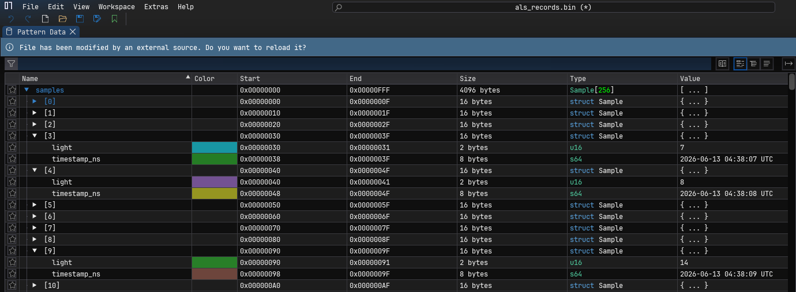

=== Reading the timestamp (nanoseconds, not seconds)

The driver stamps each record with `iio_get_time_ns()`, i.e. *nanoseconds*
on the IIO device's selected clock (`current_timestamp_clock`, default
`realtime`). A 2026 capture therefore looks like
`1781325487328050992` -- a ~1.78&#215;10^18^ value. Divide by 1,000,000,000
to get seconds since the Unix epoch:

----
1781325487328050992 ns / 1e9 = 1781325487 s  ->  2026-06-13 04:38:07 UTC
----

[WARNING]
====
ImHex's built-in *Data Inspector* `time32_t`/`time64_t` rows read the raw
bytes as `time_t` (*seconds*), so a nanosecond value overflows and shows
*"Invalid"* -- this is a unit mismatch in the inspector, not a bad
timestamp. `docs/imhex/envcombo-als-records.hexpat` instead converts
ns -> s and formats `timestamp_ns` as a real UTC date in the Pattern Data
view, so rely on that rather than the inspector rows.
====

== SMBus transaction waveforms

The captures above decode the device's registers *at rest*; this section
shows the same bytes *in motion* -- the bus transactions the driver uses to
read and write them. The driver never touches a bus directly: it issues
four `i2c_smbus_*` primitives (link:../recipes-kernel/envcombo-driver/files/envcombo.c[`envcombo.c`],
`envcombo_read_reg` / `write_reg` / `read_reg16` / `write_reg16`) and the
kernel's SMBus layer turns each into a START / address / command / data /
STOP sequence on the wire. The device answers at 7-bit address *0x39*, so
the address byte is `0x72` for a write (`0x39<<1`) and `0x73` for a read.

[NOTE]
====
These are *idealized protocol timing diagrams*, not captured traces. The
"device" here is a software kernel module
(link:../recipes-kernel/envcombo-sim/files/i2c-envcombo-sim.c[`i2c-envcombo-sim.c`])
reached through Linux's SMBus calls, so no physical SCL/SDA lines toggle
and there is nothing to capture with a logic analyzer. The waveforms below
are drawn from the SMBus spec to show the byte sequence each driver call
generates; the `SCL` lane is a schematic clock, and the `Drives` lane marks
which side -- *Master* (driver) or *Slave* (device) -- owns `SDA` in each
phase.
====

=== How the driver uses I2C

The SoC's I2C controller is the bus *master*; the ENV-COMBO is the *slave* at
address *0x39*. The driver never names that address -- at probe it is handed a
`struct i2c_client` whose `addr` is already set at the device end, and binds by
*name* (`"envcombo"`), so it would work unchanged at a different address.

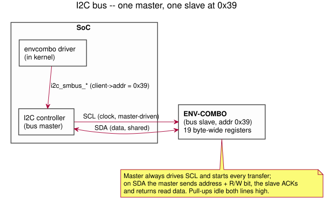

Register access goes through four SMBus helpers over `i2c_smbus_*` calls:
`read_reg` / `write_reg` (8-bit, `*_byte_data`) and `read_reg16` /
`write_reg16` (16-bit big-endian fields like ALS_OUT and the thresholds, via
the `*_word_swapped` variants -- both bytes in one transaction so the device
can't latch a new sample mid-pair). With only 19 registers the driver skips a
regmap; probe gates on `i2c_check_functionality(SMBUS_BYTE_DATA |
SMBUS_WORD_DATA)`.

The address stays the 7-bit value *0x39* everywhere in software; the
controller shifts it up by one only when framing the transaction, since the
wire's first byte packs the address into bits [7:1] and the R/W direction into
bit 0:

----
0x39 << 1       = 0x72   -> bit0 = 0  (WRITE)
(0x39 << 1) | 1 = 0x73   -> bit0 = 1  (READ)
----

That direction bit is *why a register read needs a repeated START*: the master
first writes the register index (`0x72`), then re-sends the address with the
read bit set (`0x73`) to turn the bus around -- the `Sr -> ADDR 0x73 (R)` step
in the read waveforms below.

=== Byte write and byte read

A single-register write puts the register index (the SMBus *command* byte)
and one data byte after the write address, then stops. This is the path
behind `envcombo_write_reg`, e.g. CFG (0x06) being set to 0x84 at probe.

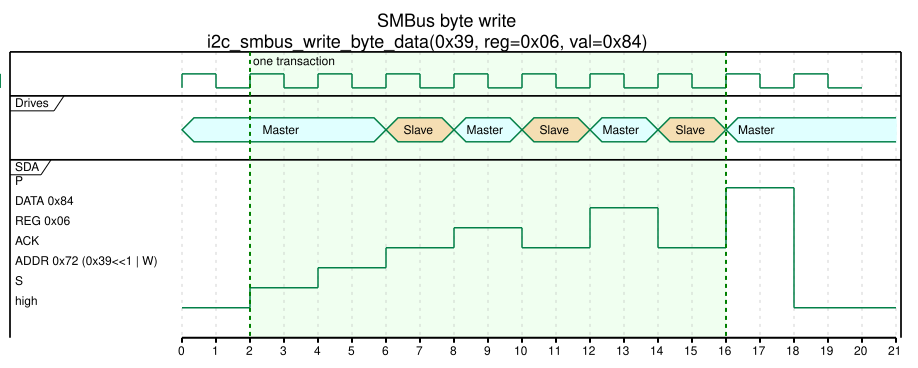

A byte read is the read-modify path's other half: the driver first writes
the register index, then issues a *repeated START* (`Sr`) and re-addresses
the device for reading (`0x73`), so no STOP releases the bus in between.
The slave drives the one data byte and the master ends the transfer with a
NAK. This is `envcombo_read_reg` -- e.g. the WHO_AM_I (0x00) identity check
at probe returning 0xEB.

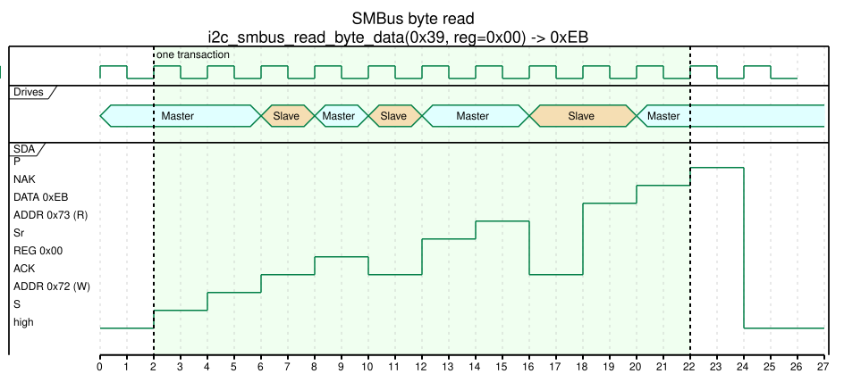

=== 16-bit (word) access -- and why "swapped"

The ALS reading and both threshold registers are 16-bit fields the device
stores *big-endian* (MSB at the lower address). The driver therefore uses
the `i2c_smbus_*_word_swapped` variants, which put the high byte on the
wire first -- "swapped" relative to SMBus's native little-endian word order.
This is the wire-level reason the `docs/imhex/envcombo-als.hexpat` pattern
above decodes those fields MSB-first.

A word write sends both data bytes (high then low) before the STOP --
`envcombo_write_reg16`, e.g. ALS_TH_LOW (0x08) set to 100 (0x0064):

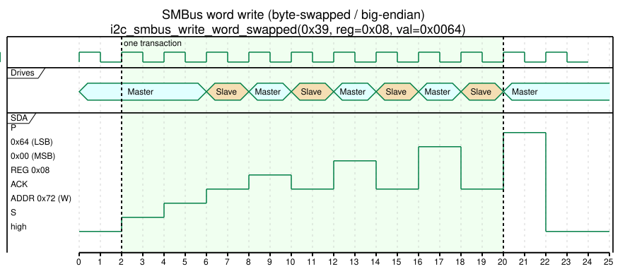

A word read mirrors the byte read but clocks out *two* data bytes: the
master ACKs the first (MSB) to ask for more and NAKs the second (LSB) to
end the transfer. This is `envcombo_read_reg16` reading ALS_OUT (0x04):

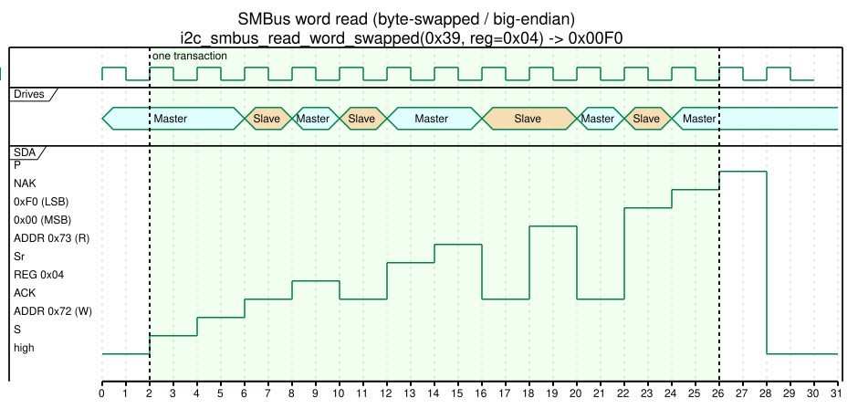

=== Overall: a full lifecycle

Zoomed out to one segment per transaction, the same primitives compose into
the driver's real traffic: probe provisions the registers (identity check,
calibration reads, CFG/INT_CFG, both thresholds), a one-shot raw read drives
`PWR_MODE` to ONE-SHOT and clocks the latched ALS word back, and a threshold
change rewrites a single 16-bit register. The `PWR_MODE` lane tracks the
device's power state across the run -- SLEEP except for the one-shot
conversion, after which the device auto-returns to SLEEP.

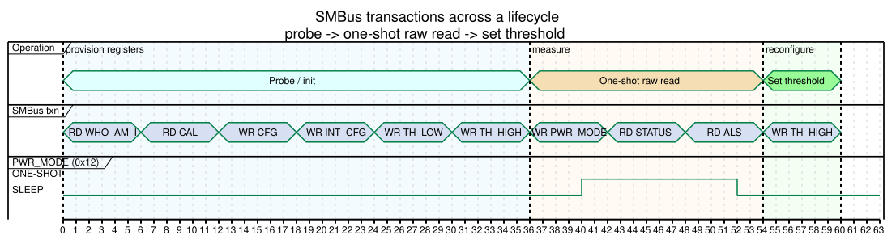

The five diagrams are PlantUML timing sources under `docs/diagrams/`
(`smbus-*.puml`); regenerate their SVGs the same way as the other diagrams
(`+plantuml -tsvg -o svg docs/diagrams/*.puml+`).
