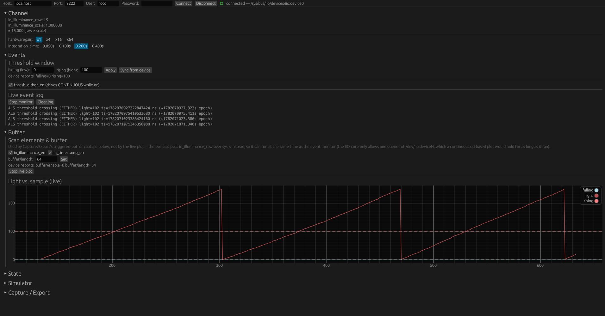

= ENV-COMBO IIO Driver -- Host GUI (envcombo-ctl)
:toc:
:toclevels: 2
:sectnums:
:docinfo: shared

[.back-to-index]
link:index.html[<- Back to documentation index]

`host-tools/envcombo-ctl/` is a host-side Rust/egui application that drives
every sysfs/debugfs/chardev knob in link:architecture.html[the userspace
ABI] through point-and-click widgets, over SSH. It is *not* part of the
graded Yocto layer build -- `conf/layer.conf`'s `BBFILES` only globs
`recipes-*/*/*.bb`, so this directory is invisible to bitbake; it's bonus
tooling that runs on the development host while QEMU is up, replacing the
manual `cat`/`echo`/`hexdump` shell dance (and the
link:debugging.html[ImHex `nc`-listener dance]) with a live control panel.

== Why SSH, not a window inside QEMU

The image boots `nographic` (no framebuffer), so a real windowed GUI cannot
run *inside* the guest -- it runs on the host and reaches the target over
SSH instead. Two small additions make that possible:

[cols="2,5", options="header"]
|===
| Addition | Purpose

| `IMAGE_FEATURES += "ssh-server-dropbear"`
  (`recipes-core/images/envcombo-image.bb`)
| Adds a minimal SSH server to the image, consistent with
  `core-image-minimal`'s footprint.

| `IMAGE_FEATURES += "allow-root-login allow-empty-password"`
| Lets the image's existing blank root password work over SSH too. These
  are the actual knobs: OE-core's rootfs postcommands rewrite
  `/etc/default/dropbear` (shipped with `DROPBEAR_EXTRA_ARGS="-w"`,
  disallow root) based on these two `IMAGE_FEATURES`. Setting
  `DROPBEAR_EXTRA_ARGS` directly from the image recipe does *not* work --
  that variable lives in the image recipe's own namespace, not the
  separate `dropbear` package's.

| `recipes-utils/envcombo-evtcat/`
| A tiny libc-only helper installed on the target. A plain shell can't
  issue `IIO_GET_EVENT_FD_IOCTL`, so threshold events need this helper to
  open the chardev's event fd and stream raw `iio_event_data` records to
  stdout for the GUI to read over an SSH exec channel. Retries its own
  `open()` for up to ~2s on `EBUSY` -- a previous instance, killed when its
  SSH channel was torn down, is blocked in `poll()` on the *event* fd at
  that point, not on anything tied to the channel, so the kill is what
  actually reclaims the chardev, and that reclaim isn't instantaneous.
|===

== Source layout

[cols="2,5", options="header"]
|===
| File | Role

| `src/main.rs` | `eframe` entry point; requests a maximized window (with a
  generous fallback size) so all six sections have room to breathe.
| `src/ssh.rs` | Blocking `ssh2` transport: one-shot `exec_async` (fresh
  connection per call, off the UI thread) and cancellable `start_stream`
  (one connection held open for the duration of a live stream, yielding a
  `StreamEvent::Data`/`Closed` enum so a remote command that exits --
  cleanly or not -- is reported instead of going silent). Authentication
  tries `none`, `password`, then `keyboard-interactive` in turn, since
  dropbear (and PAM-backed servers generally) often route blank-password
  logins through `keyboard-interactive` even when `password` looks
  supported.
| `src/abi.rs` | Sysfs/debugfs attribute paths, the simulator's register-map
  decode, the combined snapshot command + parser, the IIO event-code
  decoder, and the stray-process cleanup commands (`kill_stray_dd_cmd`,
  `kill_stray_evtcat_cmd`) run before each stream start.
| `src/app.rs` | The `eframe::App` -- connection state, the 1-second
  auto-refresh poll, and the six collapsible sections.
|===

== Connecting

[source,shell]
----
runqemu qemuarm64 envcombo-image nographic slirp
----

The exact host-side forwarded SSH port depends on your `runqemu` setup
(conventionally `2222 -> 22` with `slirp`); `envcombo-ctl`'s connection bar
defaults to `localhost:2222` / user `root` / blank password, all editable.
If the default doesn't connect, check runqemu's printed network
configuration, or test manually first:

[source,shell]
----
ssh root@localhost -p 2222   # should log in with no password prompt
----

== Building & running

[source,shell]
----
cd host-tools/envcombo-ctl
cargo build --release
cargo run --release
----

Enter the host/port/user/password in the top bar and click *Connect*. On
success the tool runs the same discovery the test harness uses
(`grep -l envcombo /sys/bus/iio/devices/iio:device*/name`) to find the
device, then starts a 1-second background poll of every read-only attribute
(raw/scale/gain/integration time, thresholds, scan_elements, buffer state,
and the simulator's debugfs register file) so every section stays live
without needing a manual refresh.

== Sections

One page, six collapsible sections (`Channel`/`Events`/`Buffer` open by
default, `State`/`Simulator`/`Capture / Export` collapsed) -- nothing is
behind a tab switch, just folded out of the way until you need it.

.envcombo-ctl with Channel, Events, and Buffer open -- a live event log and the light-vs-sample plot crossing its rising threshold

[cols="1,4", options="header"]
|===
| Section | Covers

| Channel
| `in_illuminance_raw`/`_scale`, `hardwaregain` (+ `_available`),
  `integration_time` (+ `_available`); the integration-time control is
  disabled with an explanatory tooltip when the simulator's `CAL_ATIME`
  factory override is active.

| Events
| `events/in_illuminance_thresh_{rising,falling}_value`,
  `thresh_either_en`, and a live-scrolling event log fed by
  `envcombo-evtcat` over a dedicated SSH channel. Each logged line decodes
  the IIO event code to a human-readable label (this driver only ever
  emits one: `ALS threshold crossing (EITHER)`) and follows up with a
  separate `in_illuminance_raw` read to show the light value at the time
  of the crossing -- the event record itself carries no sample, only an id
  and a timestamp.

| Buffer
| `scan_elements/in_illuminance_en` / `in_timestamp_en` and `buffer/length`
  (used by the triggered-buffer capture in Capture/Export below), plus a
  live light-vs-sample plot with the current falling/rising thresholds
  drawn as dashed reference lines, so a crossing is visible on the graph
  as it happens. The plot polls `in_illuminance_raw` over plain sysfs
  every ~250ms rather than streaming `/dev/iio:deviceN` with `dd`: the IIO
  core only allows one opener of that chardev at a time, and a continuous
  `dd` would hold it for as long as the plot ran, permanently locking out
  the Events section's `envcombo-evtcat` (which needs the same chardev
  briefly, to bootstrap its event fd). Polling sysfs instead means the
  live plot and the event monitor can run at the same time.

| State
| Read-only PWR_MODE/STATUS/CFG/INT_CFG decode from the simulator's debugfs
  register file -- never written, the same rule
  link:debugging.html[the manual debugging workflow] and the test harness
  follow.

| Simulator
| The full 19-byte debugfs register file as a labeled hex grid (including
  the out-of-scope TEMP/HUMIDITY/CAL_TOFF/CAL_HOFF fields), for
  side-by-side comparison with what link:debugging.html[ImHex] shows.

| Capture / Export
| One-click capture of the register snapshot or N buffer records straight
  to a local `.bin` file (see below), plus `modprobe`/`rmmod` convenience
  buttons for both modules. The buffer-record capture still uses `dd`
  against `/dev/iio:deviceN` -- it's a short, bounded, one-shot operation,
  not a continuous hold on the chardev, so it doesn't have the Buffer
  section live-plot's conflict with a running event monitor.
|===

== Capture/Export: replacing the `nc` dance

link:debugging.html[Manual Debugging & Binary Inspection] captures bytes
for ImHex by starting a one-shot `nc` listener on the host and having the
guest `nc` the blob out through the slirp gateway. With SSH available, the
Capture/Export section does the same job in one click: it pulls the bytes over
the already-open SSH connection and writes them directly to a local
directory (the *export directory* field -- point it at a Windows-visible
path such as `/mnt/c/Users/<user>/` to open the result straight in ImHex,
same as before).

* *Save register snapshot* -- equivalent to
  `hexdump -ve '1/1 "%02x"' /sys/kernel/debug/envcombo-sim/regs`, written
  as `regs.bin`. Decode with `docs/imhex/envcombo-als.hexpat`.
* *Capture buffer records* -- enables the buffer, captures exactly N
  records at the current `scan_elements` configuration (2-byte light-only
  or 16-byte light+timestamp), disables the buffer, and writes
  `buffer_records.bin`. Decode with `docs/imhex/envcombo-als-plot.hexpat`
  or `envcombo-als-records.hexpat` depending on which scan elements were
  enabled. Capturing N records while `CONTINUOUS` takes roughly
  `N * 200ms`, same as the manual `dd` workflow -- the GUI stays
  responsive while it waits.

== Troubleshooting

[cols="3,5", options="header"]
|===
| Symptom | Check

| Connect fails immediately
| Confirm dropbear is reachable: `ssh root@localhost -p 2222` from the
  host. If that also fails, check the actual forwarded port in runqemu's
  startup output, or that the image was rebuilt after adding
  `ssh-server-dropbear allow-root-login allow-empty-password` to
  `envcombo-image.bb`'s `IMAGE_FEATURES`.

| Connect fails with an authentication error
| The tool already tries `none`, `password`, and `keyboard-interactive` in
  turn (see Source layout above), so a real auth failure here usually
  means the password field doesn't match what the target actually expects
  -- confirm the same host/port/user/password combination works from a
  plain `ssh` first.

| Connected, but every section says no device found
| Both kernel modules need to be loaded first -- use the Capture/Export
  section's *modprobe* button, or `modprobe i2c-envcombo-sim && modprobe
  envcombo` on the target.

| Events section never logs anything
| `envcombo-evtcat` must be on the target's `PATH` (installed by the
  `envcombo-evtcat` package); also confirm `thresh_either_en` is on and
  the threshold window is actually crossable from the current raw value.
  If it logs `Device or resource busy`, something else is holding
  `/dev/iio:deviceN` open -- the live plot no longer can (it's sysfs-only
  now), so this would mean a Capture/Export buffer capture is still
  running; let it finish, or stop it, then retry.

| Buffer plot is flat or empty
| Connect status must show a device (the plot polls `in_illuminance_raw`
  over sysfs, independent of `scan_elements`); if a one-shot conversion is
  timing out you'd see that surfaced as an error instead, via the same
  status line export/channel errors use.
|===
