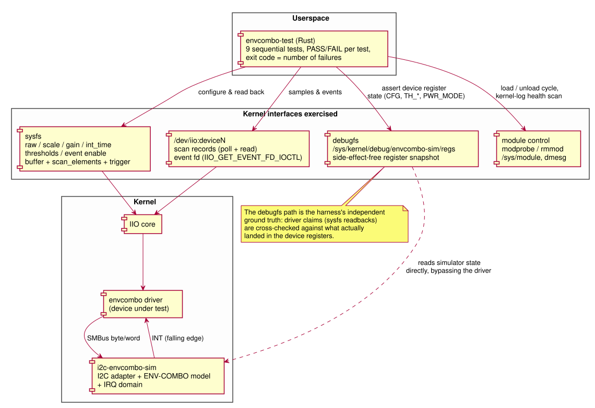

= ENV-COMBO IIO Driver -- Test Harness
:toc:
:toclevels: 2
:sectnums:

link:index.html[<- Back to documentation index]

The test harness (`recipes-utils/envcombo-test/files/envcombo-test/src/main.rs`)
is a single Rust binary, `envcombo-test`, that exercises the driver
end-to-end through its real userspace ABI and reports a PASS/FAIL verdict
per capability. It runs on the target (QEMU or hardware), needs root, and
uses only `libc` beyond the standard library -- pragmatically chosen so the
image needs no extra runtime and the cargo recipe stays trivially
fetchable.

== Test stack

Three properties make the tests able to fail when behavior is wrong, rather
than being superficial smoke checks:

Independent ground truth::
The simulator exposes its raw register file at
`/sys/kernel/debug/envcombo-sim/regs` (a side-effect-free snapshot --
unlike an I2C STATUS read it clears nothing). Wherever the driver claims
something via sysfs, the harness *also* asserts what actually landed in the
device registers: CFG gain/time fields, both threshold register pairs,
and the PWR_MODE register for every power-state assertion.

Negative testing::
Every validation path is exercised with inputs that must be rejected
(unsupported gain, unsupported integration time, inverted threshold
window, out-of-range and negative thresholds), and the harness then proves
the rejected write left no side effects.

Kernel-log health gate::
The final test scans `dmesg` for `WARNING:` / `BUG:` / `Oops` /
`refcount_t:` / `Call trace:` lines. A kernel splat fails the run even when
the operation that caused it appeared to succeed -- this is the test that
caught a trigger refcount double-put on `rmmod` and an
`iio_trigger_poll()`-from-thread-context bug during development.

== Test plan

The 9 tests run sequentially; configuration tests restore the defaults they
started from, and the power-mode assertions rely on events/buffer being
disabled in between. Exit code is 0 only if every test passes.

[cols="1,3,5", options="header"]
|===
| # | Test | What it asserts (and how it can fail)

| 1 | `module-loading`
| Both modules present (`modprobe` fallback if not autoloaded); debugfs
  reachable; an IIO device named `envcombo` with chardev and
  `envcombo-dev*` trigger appears within 5 s; device idle in SLEEP after
  probe.

| 2 | `direct-als-read`
| Three one-shot reads via `in_illuminance_raw`, 600 ms apart: each value
  within the range the default gain/time allows (<= 250), PWR_MODE back in
  SLEEP after every read, and the readings change over time (a stale or
  never-running conversion fails).

| 3 | `gain-and-integration-time`
| `_available` lists exactly the datasheet values; a valid gain write is
  visible in sysfs readback *and* the CFG register *and* the reported scale
  (0.25 at gain 4); a valid time write lands in CFG; unsupported values
  (gain 3, time 0.075 s) are rejected with state untouched; defaults
  restored.

| 4 | `threshold-attributes`
| Threshold writes land in the big-endian TH_LOW/TH_HIGH register pairs;
  inverted-window, > 16-bit, and negative writes are rejected; registers
  unchanged after the rejected writes.

| 5 | `threshold-events`
| Event fd obtained via `IIO_GET_EVENT_FD_IOCTL`. With a tight [0, 5]
  window, an above-window crossing delivers an event whose 64-bit id is
  exactly light / thresh / EITHER with a positive timestamp; the window is
  then re-armed the other way (below-window crossing) and a second event
  with a later timestamp must arrive; with the level back inside the
  window, *no* event may arrive (spurious-event check); power mode is
  CONTINUOUS while enabled and SLEEP after disable.

| 6 | `triggered-buffer`
| Scan element type is `le:u16/16>>0`; with the driver's own trigger and
  the buffer enabled: PWR_MODE is CONTINUOUS, direct reads still work,
  >= 8 samples arrive within 8 s, every sample is in range, timestamps are
  strictly monotonic with a median spacing of ~200 ms (the interrupt
  cadence), and teardown returns the device to SLEEP.

| 7 | `power-fsm-transitions`
| The multi-consumer FSM cases: events+buffer both active; a raw read while
  active stays in CONTINUOUS (no ONE-SHOT detour); disabling events while
  the buffer runs keeps CONTINUOUS *and* the buffer still delivers a fresh
  sample (backlog drained first); the mirror case (buffer off, events on);
  last consumer off -> SLEEP and the one-shot path works again.

| 8 | `module-unloading`
| `rmmod` of driver then simulator succeeds; the IIO device and the
  simulator's debugfs entry disappear; both modules then reload cleanly and
  the device re-probes into SLEEP.

| 9 | `kernel-log-health`
| `dmesg` contains no WARN/BUG/Oops/refcount/call-trace diagnostics from
  the entire run, including the unload/reload cycle.
|===

== Robustness of the harness itself

A test harness that fails for its own reasons is worse than none, so the
I/O paths are written defensively:

* All non-blocking reads go through one helper (`poll_read_nonblock()`):
  `poll()` is retried on `EINTR`, a wakeup is only treated as data when
  `POLLIN` is set, `POLLERR`/`POLLHUP`/`POLLNVAL` are reported as distinct
  failures, and `EAGAIN` counts as "no data yet" rather than an error.
* The event reader assembles the 16-byte `iio_event_data` record across
  short reads and `EINTR`, with a distinct message for EOF.
* The buffer is read non-blocking with timeouts, so a silent trigger fails
  the test instead of hanging the harness.
* Buffer teardown runs even when the test body fails, and teardown errors
  are appended to the failure message rather than masking it.

== Interpreting results

Each test prints one line:

----
[6/9] triggered-buffer             PASS
[6/9] triggered-buffer             FAIL: median sample spacing 612 ms, expected ~200 ms
----

The failure message always states the observed value and the expectation.
The process exit code is `0` on full pass and `1` otherwise, so the harness
can gate CI directly. Tests after a failed one still run (each test
re-establishes what it needs), but a failure in `module-loading` makes most
later tests fail for want of a device -- read the first failure first.
